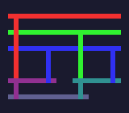
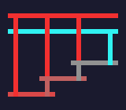
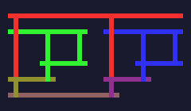
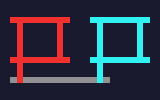

# Lambda Calculus Library

A pure Go implementation of lambda calculus with Church encoding, providing a foundation for functional programming and computational theory exploration.

## Overview

This library implements the lambda calculus, a formal system for expressing computation based on function abstraction and application. It includes Church encodings for booleans, numbers, and common operations, demonstrating that complex computations can be built from simple lambda expressions.

For an excellent introduction to lambda calculus, watch [What is PLUS times PLUS?](https://www.youtube.com/watch?v=RcVA8Nj6HEo).

## Tromp Diagrams

The library can render lambda terms as [Tromp-style diagrams](https://tromp.github.io/cl/diagrams.html) in both Unicode text and SVG with colors.

| I (identity) `λx.x` | K `λx.λy.x` | S `λx.λy.λz.x z (y z)` |
|:---:|:---:|:---:|
|  |  |  |

| Church 2 `λf.λx.f (f x)` | Church 3 `λf.λx.f (f (f x))` | Y combinator |
|:---:|:---:|:---:|
|  |  |  |

| Omega `(λx.x x) (λx.x x)` |
|:---:|
|  |

```go
// Unicode text diagram
fmt.Println(lambda.Diagram(lambda.Y))
// ┌─────┬───╴
// ├─┬─┐ ├─┬─┐
// │ │ │ │ │ │
// │ ├─┘ │ ├─┘
// ├─┘   ├─┘
// └─────┘

// SVG with custom colors
svg := lambda.DiagramSVG(lambda.Y, &lambda.SVGOptions{
    CellSize:   20,
    Background: "#1a1a2e",
    Saturation: 0.8,
})

// Animated SVG showing beta-reduction steps
anim := lambda.DiagramAnimatedSVG(term, &lambda.AnimationOptions{
    Loop:         true,
    StepDuration: 2.0,
})
```

To regenerate the example SVGs, run `go test -run TestGenerateExampleSVGs`.

## Installation

```bash
go get github.com/KarpelesLab/lambda
```

## Core Types

The library provides three main types implementing the `lambda.Term` interface:

- **`Var`** - Variables (e.g., `x`, `y`)
- **`Abstraction`** - Lambda abstractions (e.g., `λx.x`)
- **`Application`** - Function applications (e.g., `f x`)

## Basic Usage

### Creating Lambda Terms

```go
package main

import (
    "fmt"
    "github.com/KarpelesLab/lambda"
)

func main() {
    // Identity function: λx.x
    identity := lambda.Abstraction{
        Param: "x",
        Body:  lambda.Var{Name: "x"},
    }
    fmt.Println(identity) // λx.x

    // Apply identity to a variable: (λx.x) y
    applied := lambda.Application{
        Func: identity,
        Arg:  lambda.Var{Name: "y"},
    }
    fmt.Println(applied) // (λx.x) y

    // β-reduction
    result, _ := applied.BetaReduce()
    fmt.Println(result) // y
}
```

### Church Numerals

Church numerals encode natural numbers as lambda functions:

```go
// Create Church numerals
zero := lambda.ChurchNumeral(0)   // λf.λx.x
three := lambda.ChurchNumeral(3)  // λf.λx.f (f (f x))

// Convert back to integers
fmt.Println(lambda.ToInt(three))  // 3
```

### Arithmetic Operations

```go
// Addition: 2 + 3
two := lambda.ChurchNumeral(2)
three := lambda.ChurchNumeral(3)

sum := lambda.Application{
    Func: lambda.Application{
        Func: lambda.PLUS,
        Arg:  two,
    },
    Arg: three,
}

// Reduce to normal form
for i := 0; i < 100; i++ {
    reduced, didReduce := sum.BetaReduce()
    if !didReduce {
        break
    }
    sum = reduced
}

fmt.Println(lambda.ToInt(sum)) // 5
```

### Factorial Example

```go
// Calculate factorial(3)
three := lambda.ChurchNumeral(3)

result := lambda.Application{
    Func: lambda.FACTORIAL,
    Arg:  three,
}

// Reduce (may take multiple steps)
for i := 0; i < 1000; i++ {
    reduced, didReduce := result.BetaReduce()
    if !didReduce {
        break
    }
    result = reduced
}

fmt.Println(lambda.ToInt(result)) // 6
```

## Built-in Functions

### Boolean Logic

- **`TRUE`** - λx.λy.x
- **`FALSE`** - λx.λy.y
- **`AND`** - λp.λq.p q p
- **`OR`** - λp.λq.p p q
- **`NOT`** - λp.p FALSE TRUE
- **`IFTHENELSE`** - λp.λa.λb.p a b

### Arithmetic

- **`SUCC`** - Successor function
- **`PLUS`** - Addition
- **`MULT`** - Multiplication
- **`POW`** - Exponentiation
- **`SUB`** - Subtraction
- **`PRED`** - Predecessor (using Φ combinator)

### Predicates

- **`ISZERO`** - Tests if a number is zero
- **`LEQ`** - Less than or equal comparison

### Pairs and Lists

- **`PAIR`** - Creates a pair
- **`FIRST`** - Extracts first element
- **`SECOND`** - Extracts second element
- **`NIL`** - Empty list
- **`NULL`** - Tests if list is empty

### Recursion

- **`Y`** - Y combinator for recursion
- **`FACTORIAL`** - Factorial function (using Y combinator)

## Operations

### α-conversion (Alpha Conversion)

Renames bound variables to avoid name conflicts:

```go
term := lambda.Abstraction{
    Param: "x",
    Body:  lambda.Var{Name: "x"},
}
renamed := term.AlphaConvert("x", "y") // λx.x → λy.y
```

### β-reduction (Beta Reduction)

Applies functions to arguments:

```go
// (λx.x) y → y
term := lambda.Application{
    Func: lambda.Abstraction{Param: "x", Body: lambda.Var{Name: "x"}},
    Arg:  lambda.Var{Name: "y"},
}
result, reduced := term.BetaReduce()
// result: y, reduced: true
```

### η-conversion (Eta Conversion)

Simplifies expressions by removing redundant abstractions:

```go
// λx.(f x) → f (when x is not free in f)
term := lambda.Abstraction{
    Param: "x",
    Body: lambda.Application{
        Func: lambda.Var{Name: "f"},
        Arg:  lambda.Var{Name: "x"},
    },
}
result, converted := term.EtaConvert()
// result: f, converted: true
```

## Advanced Features

### Capture-Avoiding Substitution

The library automatically performs α-conversion to prevent variable capture during substitution:

```go
// (λy.x)[x := y] automatically renames y to avoid capture
abs := lambda.Abstraction{Param: "y", Body: lambda.Var{Name: "x"}}
result := abs.Substitute("x", lambda.Var{Name: "y"})
// Result is automatically renamed to avoid capture
```

### Free Variables

Check which variables are free in an expression:

```go
term := lambda.Abstraction{
    Param: "x",
    Body:  lambda.Var{Name: "y"},
}
freeVars := term.FreeVars() // map[string]bool{"y": true}
```

## Examples

See `lambda_test.go` for comprehensive examples including:
- Church numeral operations
- Boolean logic
- Arithmetic computations
- Factorial calculation
- Reduction strategies

## Theory

Lambda calculus consists of three basic constructs:

1. **Variables**: `x`, `y`, `z`...
2. **Abstraction**: `λx.M` (function definition)
3. **Application**: `M N` (function application)

These simple constructs are Turing-complete, capable of expressing any computable function.

## References

- [What is PLUS times PLUS? - Lambda Calculus Explained](https://www.youtube.com/watch?v=RcVA8Nj6HEo)
- Church, A. (1936). "An Unsolvable Problem of Elementary Number Theory"
- Barendregt, H. P. (1984). "The Lambda Calculus: Its Syntax and Semantics"

## License

This library is part of the KarpelesLab suite of tools.